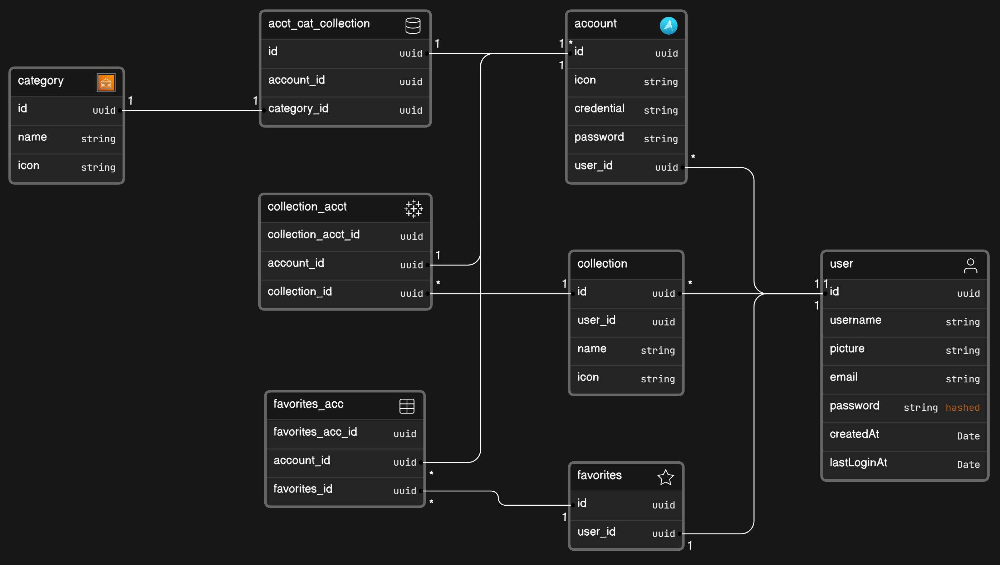

# Fortress Pass Manager

Fortress Pass Manager is a secure and user-friendly password management application built with Node.js and PostgreSQL. It allows users to securely store and manage their passwords for various accounts, such as bank accounts, gaming platforms, or any other sensitive login credentials.

## Features

- **Secure Storage:** All passwords are encrypted and securely stored in a PostgreSQL database.
- **User Authentication:** Users can register accounts and securely log in to access their password vault.
- **Password Generation:** Generate strong, random passwords for new accounts.
- **Cross-Platform Access:** Access your passwords from both web and mobile interfaces.

## Installation

1. Clone the repository:

    ```bash
    git clone https://github.com/WalidAra/FortressPassManager.git
    ```

2. Install dependencies:

    ```bash
    npm install
    ```

3. Set up your PostgreSQL database and update the database configuration in `config.js`.

4. Start the application:

    ```bash
    npm start
    ```

5. Access the application at `http://localhost:3000` in your web browser.

## Technologies Used

- Node.js
- Express.js
- PostgreSQL
- NEXT JS (for web frontend)
- React Native (for mobile frontend)

## Database Screenshot



## Contributing

Contributions are welcome! If you'd like to contribute to Fortress Pass Manager, please fork the repository, make your changes, and submit a pull request. For major changes, please open an issue first to discuss the proposed changes.

## License

This project is licensed under the [MIT License](LICENSE).
